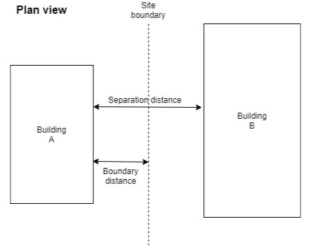
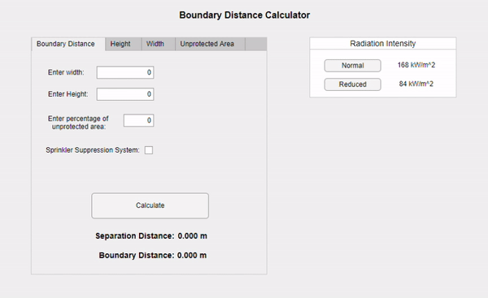

# Fire Separation Distance Tool (FSDT) - Third Year Project

## What is it?
`FSDT` is an application which efficiently calculates the **minimum separation distance** (according to [BRE 187](https://www.designingbuildings.co.uk/wiki/External_fire_spread:_building_separation_and_boundary_distances_(BR_187)) regulations) required between two buildings for a gien building's parameters. It was developed as part of my final year thesis at the University of Greenwich and is built entirely using the **MATLAB** language.

## Background
With the rate that new buildings are being constructed, it is of upmost importance that
these buildings abide by safety regulations so that they can be properly maintained and
any people using them are kept safe. Fire safety regulations are a major safety concern
for any building and they require that in the case of a building fire,
the flames should not be able to spread to any adjacent structures/buildings. The
publication also states that any surfaces within the adjacent buildings should not be
subject to so much heat radiation that the minimum heat flux value is exceeded.

This project intends to engineer an application that will be able to efficiently calculate a
safe separation distance between two given buildings in order to prevent a fire spreading
between them. Separation calculations are traditionally done by hand and therefore, with
a bespoke application, the ability to automatically have these distances calculated instantly could
prove useful to many engineers.

The boundary distance is simply the optimal line of the site boundary between the two buildings being considered, as shown in the figure above. The separation distance is the total distance required between the two hypothetical buildings.

## Installation
 To run the application, follow these steps:
 
 1. Download and install the latest [MATLAB Runtime](https://uk.mathworks.com/products/compiler/matlab-runtime.html) for your chosen operating system.
 2. Either clone the repository with `git clone https://github.com/bardenHa/Fire-Separation-Distance-Tool`, or download the `.zip` and extract it.
 3. Run the application by opening the `SeparationDistanceApp.mlapp` file.

## Usage
Choose which variable to calculate by selecting the relevant **Tab**. Input the necessary parameters such as `Height`, `Width`, `Unprotected Area` etc. Select a `Radiation Intensity` and finally click `Calculate` to obtain separation distance and boundary distance results.

## Contributing 
When experiencing any problems using the application, please submit an issue. Pull requests are also welcome should the user wish to implement any changes to the application.
## License
This project uses the [MIT License](Library/LICENSE).